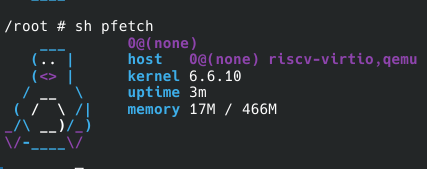

# AvrovaDonz2026 

## bio

- GitHub ID: AvrovaDonz2026
- email: 4vr0va@d0n2.in
- rootfs Repo: https://github.com/AvrovaDonz2026/lfs-riscv

## Rootfs 

- filename: rootfs-riscv64-lfs-AvrovaDonz2026.tar.zst
- SHA256: 4002e5b862f3d5bff0ad3b7ef476e14215476cfa753c9653f0924203ec65246f

## how to run rootfs from download

> goal：the shortest steps from "download rootfs"to run "pfetch"

### shortest step:

1. Download rootfs and Image:
```bash
wget https://github.com/AvrovaDonz2026/lfs-riscv/releases/download/unstable/rootfs-riscv64-lfs-AvrovaDonz2026.tar.zst
wget https://github.com/AvrovaDonz2026/lfs-riscv/releases/download/unstable/Image
```
2. extract rootfs and build lfs-riscv64.img:
```bash
tar --zstd -xvf rootfs-riscv64-lfs-AvrovaDonz2026.tar.zst

qemu-img create lfs-riscv64.img 5G
sudo mkfs.ext4 lfs-riscv64.img

sudo mount -o loop lfs-riscv64.img /mnt
sudo cp -r rootfs-riscv64-lfs-AvrovaDonz2026/* /mnt
sudo umount /mnt
```

3. run QEMU:
```bash
qemu-system-riscv64 \
  -machine virt \
  -m 128M \
  -bios default \
  -kernel Image \
  -append "root=/dev/vda rw" \
  -drive file=lfs-riscv64.img,format=raw,id=hd0,if=none \
  -device virtio-blk-device,drive=hd0 \
  -nographic
```

login and run `sh /root/pfetch` see the result

## pfetch evidence



## How This Was Forged (Build Process Overview)

- **Reference/Tutorial**: Based on [Linux From Scratch](https://linuxfromscratch.org/lfs/view/stable/) methodology, adapted for RISC-V64 with musl libc.
- **Key Components**:
  - **C Library**: musl 1.2.5 (static-link friendly, no NSS complexity)
  - **Toolchain**: GCC 13.2.0 + Binutils 2.42 (via musl-cross-make)
  - **Kernel**: Linux 6.6.10 (with VirtIO drivers for QEMU)
  - **Userspace**: BusyBox 1.36.1 (fully static, single binary)
  - **Init**: Custom `/init` shell script (no systemd, no SysVinit)
  - **Boot Flow**: OpenSBI → Linux (direct `-kernel` load, no U-Boot)
- **Deviations from "Orthodox LFS"**:
  - Uses **musl** instead of glibc (no `/lib64` pollution, true static linking)
  - Uses **BusyBox** instead of GNU coreutils/util-linux (minimal footprint)
  - Fully static userspace (no dynamic linker dependency for base tools)
  - No package manager (immutable rootfs approach)

## Pitfalls Encountered

- **Pitfall 1: musl dynamic linker trap**  
  The `ld-musl-riscv64.so.1` symlink in the toolchain points to absolute path `/lib/libc.so`, appearing broken on the host. Solution: manually copy `libc.so` to rootfs and recreate relative symlink (`ln -s libc.so ld-musl-riscv64.so.1`).

- **Pitfall 2: BusyBox `tc` vs Kernel Headers**  
  BusyBox 1.36.1's `tc` (traffic control) applet conflicts with Linux 6.6.10+ headers (`TCA_CBQ_MAX` undeclared). Solution: disable `CONFIG_TC` in BusyBox config before compiling.

- **Pitfall 3: Missing build essentials**  
  Kernel build failed with `make: flex: not found` and `bc` errors. Solution: install `flex`, `bison`, and `bc` on host (Debian 12) before starting — these are required for Kconfig and kernel time calculations.

- **Pitfall 4: VFS mount panic**  
  Initial boot failed with "VFS: unable to mount root". Root cause: either missing `CONFIG_VIRTIO_BLK=y` in kernel config, or incorrect `root=/dev/vda` parameter (must match virtio block device name).
## Known Issues / TODO

- **Job control warning**: On boot, `/bin/sh: can't access tty; job control turned off` appears. This is expected behavior in raw QEMU serial console without proper TTY allocation.
- **TODO - Service Manager**: Currently using primitive shell script as init. Future options: **dinit** (musl-native), **s6**, or **runit** (Void Linux style).
- **TODO - Dynamic transition**: Current BusyBox is fully static (~1.5MB). For space saving, plan to rebuild as dynamic linked (~200KB + 900KB musl shared lib) once package management is implemented.


## License and Security Statement

- **Static Linking Security**: The rootfs uses statically linked BusyBox, ensuring the init system functions even if `/lib` libraries are corrupted or tampered with.
- **No Secrets Included**: This rootfs is built from pristine upstream sources (musl-cross-make, kernel.org, busybox.net) and contains no SSH keys, tokens, credentials, or private data. The build is reproducible from the documented toolchain.
- ** musl Licensing**: All components (musl, BusyBox, Linux) are permissively licensed (MIT/BSD/GPLv2). No binary blobs included.
